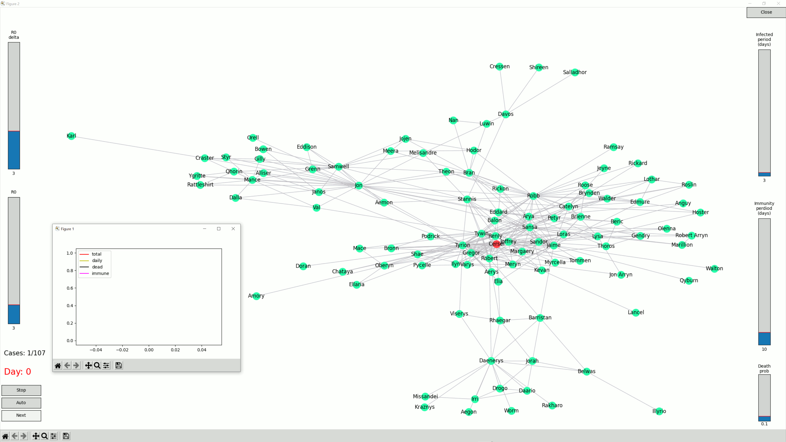

# DISEASE SPREAD

Python project to visualize a virus dissemination.

## Insallation

Run `pip install -r requirements.txt`.

If you use a Linux system, make sure Tkinter is installed : `sudo apt-get install python3-tk`

## Run

Run `python3 program.py` to start the visualization.

Warning: to close the window and stop the program, use the *close* button and **DO NOT** use the red cross of the window.

### Command line options

- `-t` sets the animation time = time between frames with a float. `-t 0.25`
- `-r` is used to defined the root / starting point of the spread with a string: `-r a_node_name`
- `-db` is used to set the database filename with a string. 3 defaults possibilities: trump, got, marvel : `-db trump` (the default one is got)
- `-l` sets the amount of days between the infection and the beginning of lockdown. The lockdown duration is equal to the infected period : `-l 3`. If this option isn't used, lockdown is disabled.

Full example : `python3 program.py -t .25 -db trump -r Donald\ J.\ Trump -l 3` 

## Customise

To use other databases, make sure:
- the table name match the file name,
- two databases are involved: `vertices` and `edges`,
- the vertices db use at least columns `id` and `name`, and `status` if needed,
- the edges db use at least columns `fiedl1` and `field2`.

## Screenshot

## Credits

Databases are based on the repository [sample-social-network-datasets](https://github.com/melaniewalsh/sample-social-network-datasets) from Melanie Walsh.
